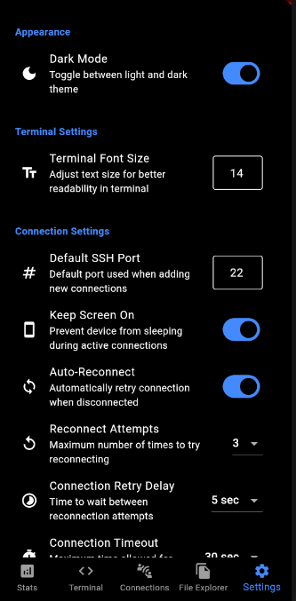

# RaspberryPi-Control

RaspberryPi-Control is a Flutter application that allows you to control and monitor your Raspberry Pi remotely. You can execute commands, view system stats, manage SSH connections, and transfer files.

## Features

### Core Functionality
- Connect to Raspberry Pi via SSH
- Execute commands on the Raspberry Pi
- View detailed system stats (CPU, memory, temperature, disk usage, network traffic, etc.)
- Manage multiple SSH connections
- Transfer files between your device and the Raspberry Pi
- Start, stop, and restart services on the Raspberry Pi
- Light and dark theme support

### Advanced Connection Features
- Background connectivity that keeps your connection alive when app is minimized
- Auto-reconnect functionality when connection drops
- Configurable connection timeout settings
- SSH keep-alive to prevent dropped connections
- Security timeout to automatically disconnect after inactivity
- Screen wake lock to prevent device from sleeping during active connections
- SSH compression option for slow networks

### File Management
- Browse remote files with intuitive interface
- Upload and download files between devices
- Toggle hidden files visibility
- Configurable file overwrite confirmation
- Custom default download directory

### User Experience
- Custom terminal font size settings
- In-app update system with automatic update checking
- View release notes for new versions
- Battery optimization management

## Important Notes

⚠️ **Language Requirement**: The Raspberry Pi must be set to English or German locale for all features to work correctly. Some monitoring features may not work properly with other system languages.

⚠️ **Background Operation**: To maintain connections in the background, you may need to exclude the app from battery optimization.

## Screenshots

<p align="center">
  
  
  
  
  
</p>

## Getting Started

### Prerequisites

- Flutter SDK: [Install Flutter](https://flutter.dev/docs/get-started/install)
- Dart SDK: Included with Flutter
- A Raspberry Pi with SSH enabled

### Installation

1. Clone the repository:
    ```bash
    git clone https://github.com/Lukas200301/RaspberryPi-Control.git
    cd RaspberryPi-Control
    ```

2. Install dependencies:
    ```bash
    flutter pub get
    ```

3. Run the app:
    ```bash
    flutter run
    ```

## Usage

1. Launch the app on your device or emulator.
2. Navigate to the "Connections" tab to add a new SSH connection.
3. Enter the connection details (name, host, port, username, password) and save the connection.
4. Select the saved connection to connect to your Raspberry Pi.
5. Use the "Terminal" tab to execute commands on the Raspberry Pi.
6. Use the "Stats" tab to view detailed system stats.
7. Use the "File Explorer" tab to transfer files between your device and the Raspberry Pi.
8. Use the "Service Control" section in the "Stats" tab to start, stop, and restart services.

## Configurable Settings

### Appearance
- **Dark/Light Theme**: Choose between dark and light mode for the app interface

### Terminal Settings
- **Terminal Font Size**: Adjust text size for better readability in terminal

### Connection Settings
- **Default SSH Port**: Set your preferred default port for new connections
- **Keep Screen On**: Prevent device from sleeping during active connections
- **Auto-Reconnect**: Automatically try to re-establish connection when dropped
- **Reconnect Attempts**: Configure how many times the app should try to reconnect
- **Connection Retry Delay**: Set time between reconnection attempts
- **Connection Timeout**: Maximum time allowed for SSH connections to establish
- **SSH Keep-Alive**: Send periodic signals to prevent connection drops
- **Security Timeout**: Automatically disconnect after a period of inactivity
- **SSH Compression**: Enable compression to save data on slower networks

### File Explorer Settings
- **Show Hidden Files**: Toggle visibility of files starting with a dot (.)
- **Confirm File Overwrite**: Choose whether to prompt before replacing existing files
- **Default Download Directory**: Set a fixed location for downloaded files

### Data Management
- **Clear App Data**: Reset all settings and remove saved connections

### Background Operation

The app will maintain connections in the background. A notification will appear to indicate the app is running. For best performance:

1. Allow the app to show notifications
2. Exclude the app from battery optimization (prompted during first run)
3. Grant necessary permissions when requested

## Updates System

The app includes a robust update management system:
- Automatic update checking on app launch
- Manual update checks from the Settings tab
- Direct in-app download and installation of updates
- Detailed release notes for new versions
- Open release page option for manual downloads

## Dependencies

- `flutter`: The Flutter SDK
- `dartssh2`: SSH client library for Dart
- `flutter_background`: For keeping the connection alive in background
- `shared_preferences`: For storing connection details locally
- `convert`: For encoding and decoding data
- `file_picker`: For picking files to upload
- `fl_chart`: For displaying charts
- `permission_handler`: For managing app permissions
- `package_info_plus`: For version information
- `flutter_secure_storage`: For secure credential storage
- `path_provider`: For file system access
- `device_info_plus`: For device-specific information

## Development

### Building

To build the app, run:
```bash
flutter build apk
```

### Testing

To run tests, use:
```bash
flutter test
```

## Contributing

Contributions are welcome! Please open an issue or submit a pull request.

## License

This project is licensed under the MIT License - see the [LICENSE](LICENSE) file for details.
