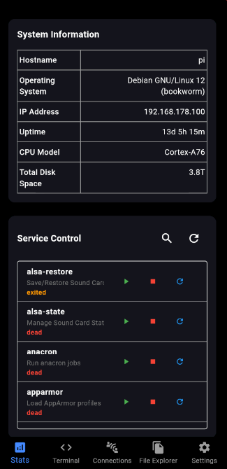
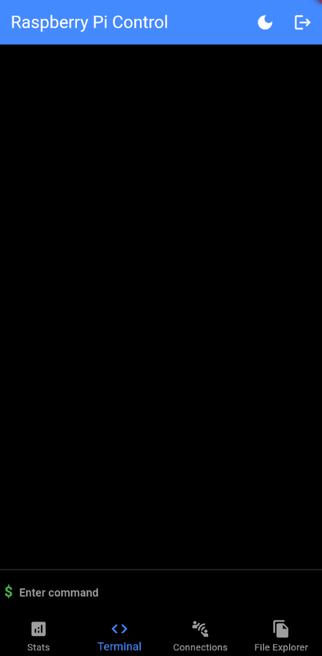
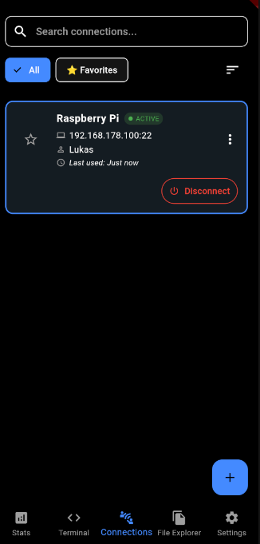
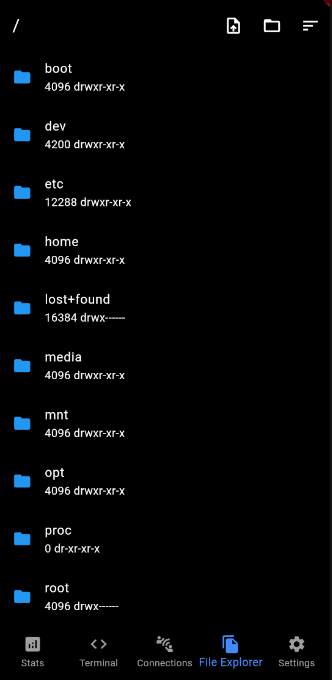

# RaspberryPi-Control

RaspberryPi-Control is a Flutter application that allows you to control and monitor your Raspberry Pi remotely. You can execute commands, view system stats, manage SSH connections, and transfer files.

## Features

- Connect to Raspberry Pi via SSH
- Execute commands on the Raspberry Pi
- View detailed system stats (CPU, memory, temperature, disk usage, network traffic, etc.)
- Manage multiple SSH connections
- Transfer files between your device and the Raspberry Pi
- Start, stop, and restart services on the Raspberry Pi
- Light and dark theme support

## Important Notes

⚠️ **Language Requirement**: The Raspberry Pi must be set to English or German locale for all features to work correctly. Some monitoring features may not work properly with other system languages.

## Screenshots

<p align="center">
  
  
  
  
</p>

## Getting Started

### Prerequisites

- Flutter SDK: [Install Flutter](https://flutter.dev/docs/get-started/install)
- Dart SDK: Included with Flutter
- A Raspberry Pi with SSH enabled

### Installation

1. Clone the repository:
    ```bash
    git clone https://github.com/Lukas200301/RaspberryPi-Control.git
    cd RaspberryPi-Control
    ```

2. Install dependencies:
    ```bash
    flutter pub get
    ```

3. Run the app:
    ```bash
    flutter run
    ```

## Usage

1. Launch the app on your device or emulator.
2. Navigate to the "Connections" tab to add a new SSH connection.
3. Enter the connection details (name, host, port, username, password) and save the connection.
4. Select the saved connection to connect to your Raspberry Pi.
5. Use the "Terminal" tab to execute commands on the Raspberry Pi.
6. Use the "Stats" tab to view detailed system stats.
7. Use the "File Explorer" tab to transfer files between your device and the Raspberry Pi.
8. Use the "Service Control" section in the "Stats" tab to start, stop, and restart services.

## Dependencies

- `flutter`: The Flutter SDK
- `dartssh2`: SSH client library for Dart
- `shared_preferences`: For storing connection details locally
- `convert`: For encoding and decoding data
- `file_picker`: For picking files to upload
- `fl_chart`: For displaying charts
- `flutter_background`: For keeping the connection alive in background

## Development

### Building

To build the app, run:
```bash
flutter build apk
```

### Testing

To run tests, use:
```bash
flutter test
```

## Contributing

Contributions are welcome! Please open an issue or submit a pull request.

## License

This project is licensed under the MIT License - see the [LICENSE](LICENSE) file for details.
